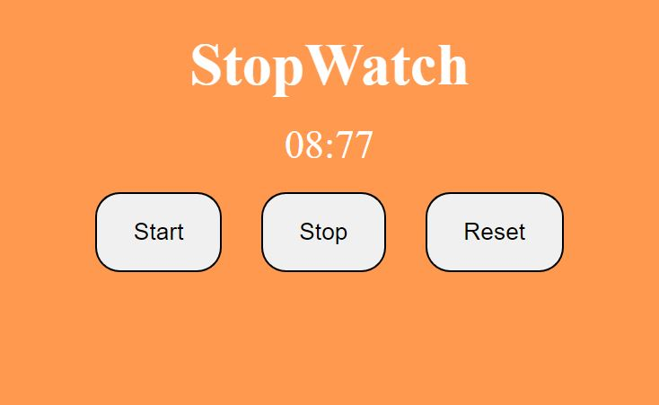

# ⭐ Project - Stop Watch⭐

This  project of javascript is made from pure HTML,CSS and Javascript.

I got this assignment from iNeuron Bootcamp.

 

📌 Learnings:

👉 1\. HTML, CSS and DOM Manipulation 
👉 2\. Working with setInterval and how to clear the interval. 
👉 2\. Convertion of time from milliseconds to HH:MM:SS format. 

 

> Time taken to build this project is 1.5 hr.

  

## Links

[Link](javascriptmystopwatch.netlify.app)

[Linkedin](https://www.linkedin.com/in/pratyush-kesarwani-2b6601171/)

### Acknowledgements:

I am thankful to Hitesh Choudhary sir, Anurag sir and iNeuron team for this amazing bootcamp.
